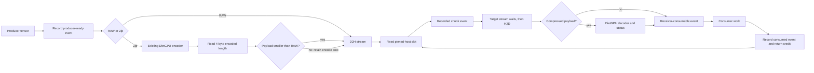
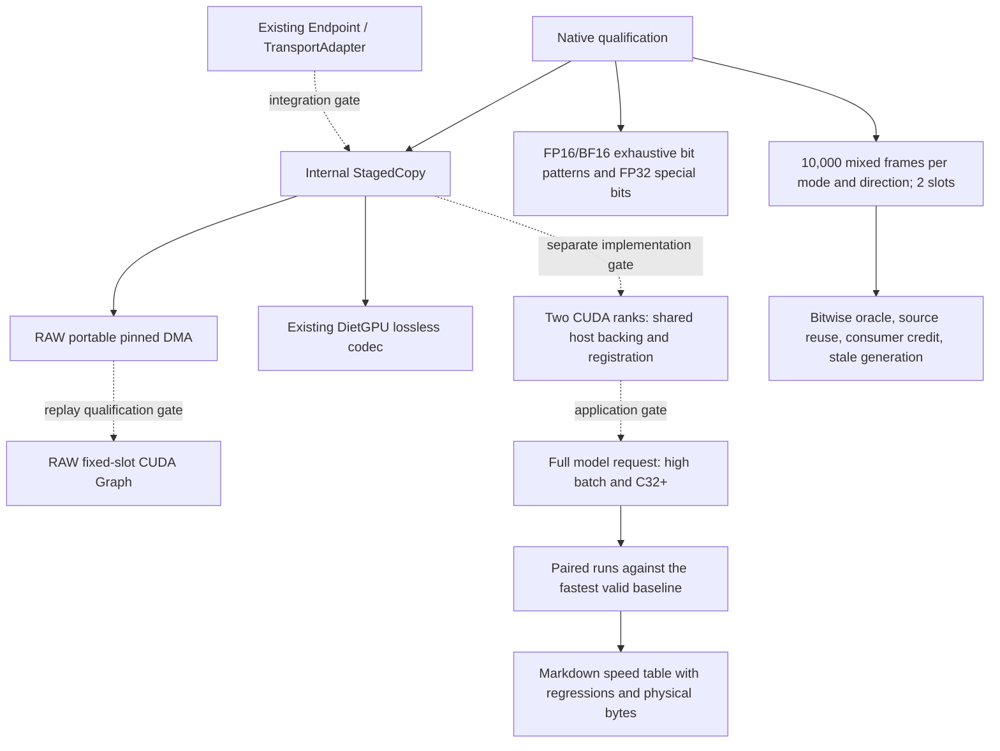

# Local CE and lossless Zip design

The implementation adds an internal `p2p/local/StagedCopy` primitive and native
qualification programs. It stages bytes through a bounded portable pinned-host
pool, using CUDA copy streams for D2H and H2D. The Zip mode uses the existing
DietGPU float codec. It preserves floating-point bits and chooses RAW when the
encoded payload is larger than the input or the dtype/alignment is unsupported.

This is a single-process, two-device implementation. It has not been connected
to the production Endpoint/TransportAdapter, separate CUDA ranks or a model
server. Native correctness, CUDA Graph replay and application performance remain
qualification gates; source preparation is not an E2E result.

## Data and ownership

Every event is recorded before the dependent stream waits. A ticket contains a
slot and generation. A full queue returns an invalid ticket; completion of H2D
alone does not make its slot reusable. The caller queues consumer work and then
returns credit. Reuse waits for that recorded consumer event to complete. The
caller retains source and destination allocations for their corresponding
lifetimes. Teardown drains only this primitive's streams and outstanding credits.

Zip currently synchronizes the small encoded-length event in `submit`. This is
the Z1 path: host submit cost includes the encode and metadata wait. It must be
measured before introducing a separate CPU progress worker. RAW submission
queues copies and dependencies without waiting for transfer completion.

## Bounded resources and accounting

One encoder scratch lane and one decoder scratch lane serve the fixed slot
pool. Increasing caller concurrency does not allocate one workspace per request.
The maximum frame is 64MiB; the payload-plus-metadata pinned pool is capped at
256MiB. Each slot has a fixed maximum encoded capacity and fixed chunk events.
The encoded capacity uses the codec's upper bound, which can exceed RAW size.

An 80-byte `Frame` records version, codec, dtype, raw and payload lengths,
request, slot, generation, destination capacity and destination offset. It is
same-process control metadata today, not an on-wire or cross-rank protocol.
The actual codec header is part of the compressed payload.

Physical byte counters include the payload on both PCIe legs, the 4-byte
encoded-length read for every attempted encode, and the 5-byte decoder
status/word-count read for compressed frames. A post-encode RAW fallback still
pays encode and metadata costs. Segment times use events from one device only;
end-to-end latency must use host monotonic time through receiver completion.
Logical bytes per second are not reported as PCIe bus bandwidth.

RAW has no transport compute kernel in the source. The zero-CTA claim requires
a CUDA trace proving that the measured RAW path contains copies and event
operations only. Zip launches encoder/decoder kernels and cannot claim zero CTA.
The correctness test also launches a source-poison memset, so its trace is not
the RAW transport profile.

## Integration and remaining gates

Native tests cover both devices and both transfer directions. Codec tests use
all 65,536 FP16/BF16 bit patterns, explicit FP32 signed-zero/NaN/infinity and
subnormal bits, deterministic remaining bits and boundary lengths. Staged tests
use empty, odd, aligned and misaligned frames, compressible and varying data,
source poisoning, queue saturation and stale tickets over 40,000 total frames.
These are intended checks until actual run receipts confirm them.

Two-rank transport requires shared host backing plus registration in each
process, explicit frame publication, generations and consumer credit. A pointer
or same-process CUDA event cannot substitute for that protocol. Graph replay
requires at least 2,000 verified replays without resource growth. Model E2E
requires actual complete requests, multiple high batch sizes and C32+; native
queue depth is not HTTP request concurrency. Performance uses at least three
fresh paired runs with alternating order, bitwise correctness checks and all
failed or slower configurations retained.

## Current evidence

PRO5000 testing was cancelled by the human. Its first native build compiled the
SM120 codec library but failed on a missing standalone `<cassert>` include
before GPU tests. The include is fixed; the second SSH connection was refused.
There is no PRO5000 speed result.

The replacement endpoint inventories as two RTX PRO6000 Blackwell Server
Edition 96GB cards, CUDA13.0.88, driver580.95.05 and SYS topology across NUMA0/1.
Kandinsky preparation already occupies this node; a dual-GPU qualification
window has been requested. Hardware inventory does not authorize taking a peer
job's slot. Thor and RTX5080 single-device E2E remain separate outstanding gates.

| Gate | Actual status | Speedup versus baseline |
|---|---|---|
| PRO5000 native codec/DMA | Cancelled before GPU execution | Not measured |
| PRO6000 native codec and bounded staging | Pending resource handoff and execution | Not measured |
| Two-rank RAW/Zip | Not implemented or measured | Not measured |
| RAW Graph replay and zero-CTA trace | Not run | Not measured |
| Full model, high batch and C32+ | Not run | Not measured |
| Thor/RTX5080 single-device model E2E | Pending original target handoff | Not measured |

Build the frozen source with `make -C p2p/tests/local_transfer SM=120
NVCC=/usr/local/cuda/bin/nvcc -j2`. Run `probe`, `codec_test` and `staged_test`
from `p2p/tests/local_transfer/build/sm120` only within the admitted finite slot.
Keep source hashes, native exits, runtime versions and raw reports with each
measurement. No model weights belong in this repository.
