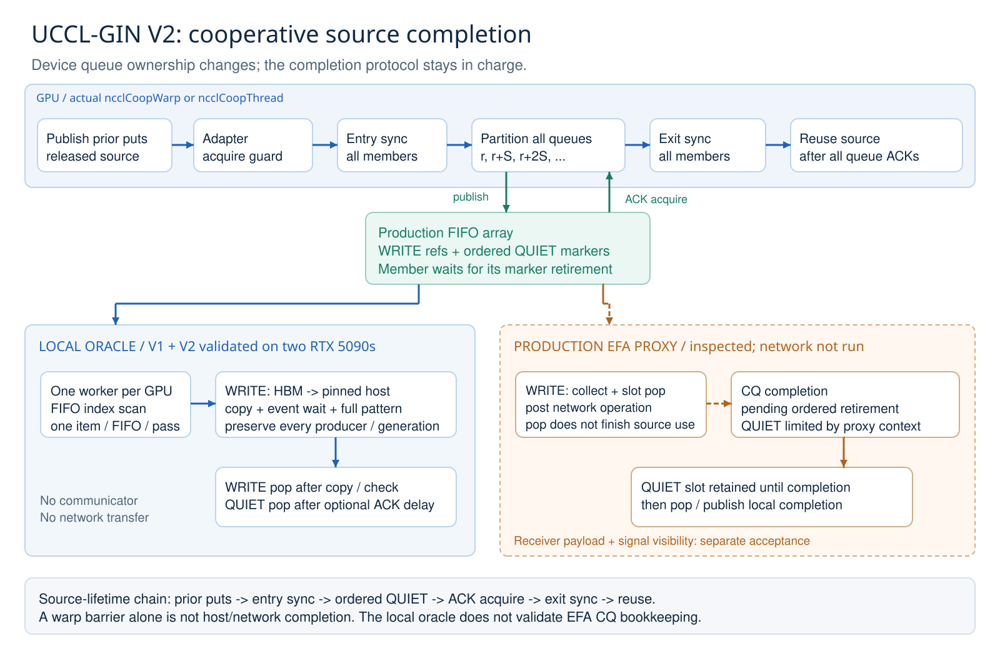
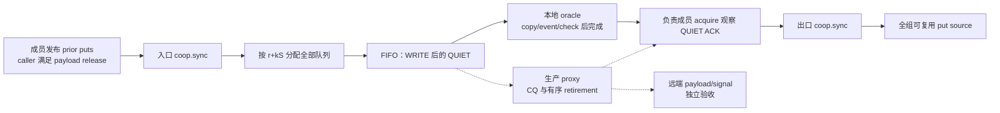
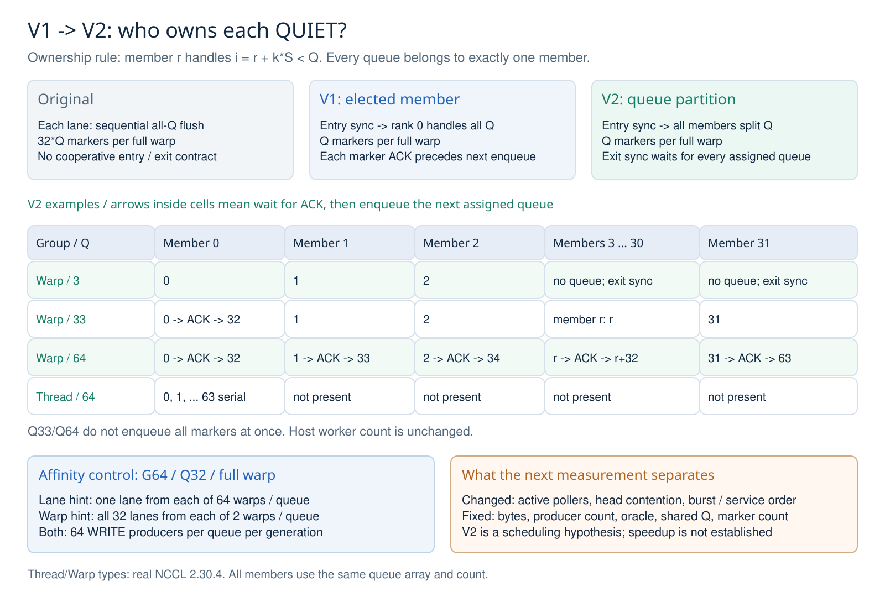
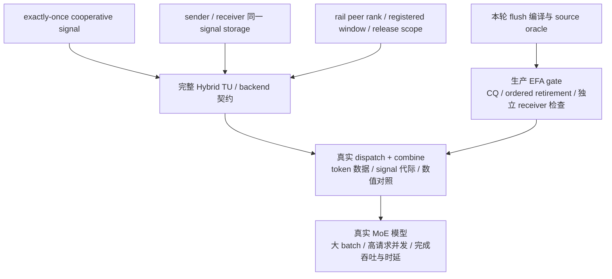

# UCCL-GIN V2：合作组 flush 的队列分工与验证设计

日期：2026-10-04。状态：生产候选已实现；本轮诊断 fixture 与 host 检查已完成，新的 CUDA 编译和 GPU 测量尚未执行。历史 0.91× 仍然保留，不能写成已修复。

本设计让一个合作组共同完成 flush：入口汇合所有成员的 prior puts，成员各自负责一组 FIFO 的 QUIET，出口汇合所有队列的完成，再允许复用 source。V2 尝试缩短 V1 的跨队列等待链，不增加 host worker，也不改变生产 proxy 的完成协议。

用户提供的 `UCCL_GIN_V2_Review_And_Next_Run_2026-10-04.md` 是 review 输入。其引用的 patch 和 host-validation JSON 未随附件提供；这里实现并核验的是当前 checkout 的新 fixture，不复用该文档的测试记录或文件指纹。

## 1. 问题与已知结果

Original 的 adapter 忽略 Coop，让每个 lane 调用 scalar all-queue flush。V1 增加入口/出口同步，由 rank 0 顺序处理全部队列。V2 保留两次同步，把队列分给合作组成员。

| 版本 | 完整 warp 每次 flush 的 QUIET 数 | 谁等待队列 | 合作组完成汇合 |
| --- | ---: | --- | --- |
| Original | 32Q | 32 个 lane 各自顺序处理 Q 条 | 缺少显式合作组入口/出口 |
| V1 | Q | rank 0 顺序处理 Q 条 | 入口与出口同步 |
| V2 | Q | 成员 r 处理 r+kS；S 为合作组大小 | 入口与出口同步 |

Original→V1 同时改变命令数、同步、活跃轮询者和提交时序；V1→V2 的干预更窄，但仍会改变轮询与服务分布。“V1 顺序等待队列”提供一个优化方向，单凭它不能解释 V1 为什么比同样顺序等待的 Original 慢。

以下是历史 V1 的**双卡同时负载**，不是 V2 的结果：每卡 G64/Q32/BS2048、两次迭代，完整 source-copy oracle。时间是 median / p95，单位 ms；速度比为 Original/V1。

| 物理 GPU | Original | V1 | 速度比 | 暖观测数 / 臂 |
| --- | ---: | ---: | ---: | ---: |
| 0 | 1643.863 / 1811.548 | 1543.112 / 1624.250 | 1.07× | 4 |
| 3 | 1851.091 / 2009.429 | 2024.331 / 2061.415 | 0.91× | 4 |

GPU3 两个独立配对 block 的中位速度比分别是 0.8448×、0.9792×，两者都回退。尚无证据把它归为方向反转或单纯噪声。原始版本、样本和其他大 BS 回退见 [速度结果](COOP_FLUSH_RESULTS.md)。历史已测 V1 固定为 `f77da5123a8e75fb4e9ad5525370c66c140c8056`；Original 固定为 `29e7e7ca868590fb3a70bc96ebf42271983ab9b6`。

## 2. 架构关系与完成链



**Figure 1.** 上方是设备端调用与 source 生命周期。下方两条是不同的消费路径：蓝色为本地 oracle，橙色为已检查源码、尚未运行的 EFA proxy。入口/出口同步提供组内汇合，真正的本地完成依赖 QUIET slot 的正确 retirement。



`flush` 的目标是合作组 prior puts 的 source 已被本地消费；远端完成需要独立验收。这与 [NVIDIA GIN flush 契约](https://docs.nvidia.com/deeplearning/nccl/user-guide/docs/api/device_gin.html#ncclGin::flush) 一致。当前在线文档显示 2.32.3，本实验的 device headers 固定为 **2.30.4**，不会据此引入较新版本的 signal 接口。

源码中的关键关系：

| 组件 | 职责与证据 |
| --- | --- |
| [Adapter](../../../../thirdparty/nccl-ep/adapter/uccl_gin_net.cuh) | 转交真实 Coop，仅接受 acquire order |
| [UCCLGin](../../uccl_gin/uccl_gin.cuh) | 两次组同步，分配队列，QUIET enqueue 后等待对应 slot |
| [FIFO device](../../transport/fifo_device.hpp) | `poll(slot)` 用 acquire 观察 tail；这是已检查的 MSCCLPP 路径 |
| [QueueFixture](queue_fixture.hpp) | 每 GPU 一个 worker，按 FIFO 下标扫描，每轮每队列最多消费一个命令 |
| [Production proxy](../../transport/proxy.cpp) | WRITE 可在收集时 pop；QUIET 保留至 CQ/按队列顺序的 pending retirement |

本地 oracle 在 WRITE 完成 copy/event/full-pattern check 后才 pop；生产 WRITE slot 在网络完成前就可能被取走。因此，只等 WRITE slot 或看到 host 已读命令，都不足以证明生产 source 可复用。生产 QUIET ACK 的协议必须单独通过网络测试。`__syncwarp()` 本身也不能代替这项完成证明。

非 MSCCLPP ring 的 tail 当前用 volatile load，缺少这里使用的显式 acquire 论证；这项已有的 backend 验证缺口仍未关闭。

## 3. V2 的生产改动

生产候选 `a3dcc2dafeb4077149773eb24fc3a61f7f66b4a5` 的核心只有：

```cpp
coop.sync();
for (uint32_t i = coop.thread_rank(); i < res.num_queues;
     i += coop.size()) {
  quiet_on_queue(res.d2h_queues[i], static_cast<int>(i));
}
coop.sync();
```

沿用真实 NCCL `ncclCoopThread` / `ncclCoopWarp` 和类型限制；scalar `flush()`、FIFO/proxy、adapter acquire guard 均保留原实现。本轮只继续改测试与设计说明。



**Figure 2.** 任意队列 i 唯一对应成员 `i mod S`、步数 `floor(i/S)`，所以分工无遗漏且不重复。Warp Q3 的其余成员仍要参加出口同步；Q33/Q64 中同一成员必须等前一条 ACK 后才提交下一条，不能宣称所有 64 条 marker 一次发布。Thread 的 S=1，仍顺序处理所有队列。

完成链成立需要以下前提：所有成员到达同一次 collective；组内 queue 数组、顺序和数量一致；数组覆盖成员 prior puts 使用的全部队列；资源/source 生命周期有效且 payload 已满足必要 release；QUIET retirement 真正表示其覆盖传输的本地消费完成。

V2 可以让不同成员的首条 marker 更早可见，是否缩短关键路径取决于 FIFO 排队、host 扫描、copy/event/check 和生产 `quiet_inflight`。它不是“32 倍并行网络服务”。若后续实测表明 Q>S 的第二步仍明显串行化，再研究分离 enqueue/wait，并先证明 slot ownership 与任意 Q 的生命周期。

## 4. 本轮 fixture 迭代

| 新选项 | 默认 | 实际用途 |
| --- | --- | --- |
| `--channel-hint lane\|warp` | lane | lane index 或 warp group ID；warp 只用于完整 warp |
| `--num-lanes N` | 1 | 使用生产 proxy-major 路由；N 整除 Q；不增加 host worker |
| `--delay-queue q` | Q−1 | 延迟指定 FIFO 的 ACK，可覆盖早队列与后续步队列 |
| `--diagnose-consumer 0\|1` | 0 | 单独采集 host 分段时间；主速度对照关闭 |

设 `L=hint mod Q`、`P=Q/N`，生产路由为 `queue=(L mod N)*P+floor(L/N)`。host oracle 从实际 FIFO 下标反推逻辑 channel，独立建表，检查每条 WRITE 的实际路由和每队列最终 WRITE/QUIET 计数。所有 producer/generation/word 的 source-reuse 校验保留。

private 模式下，每条队列在人工延迟**之后、ACK 之前**检查组内全部 returned 状态；入口顺序检查也按真实映射统计 writers。它修正了旧测试仅检查 Q−1、且检查在 sleep 之前的局限。

在目标 G64/Q32 下，lane hint 为每个队列汇集 64 个 warp 各 1 个 lane；warp hint 为 2 个 warp 各 32 个 lane。每队列总 WRITE 都是每 generation 64 条，改变的是 head 竞争、突发和消费顺序。private 模式又会把 worker 扫描的 FIFO 从 32 增为 2,048，因此只用于完成语义/拓扑压力，不作为三臂主要性能对照。

| 诊断字段 | 解释 |
| --- | --- |
| `callback_ns` | callback 总 wall time，含下面三项、断言和人工 QUIET 延迟 |
| `copy_event_submit_ns` | host 提交 copy 与 event record |
| `event_sync_ns` | host event synchronize 调用耗时 |
| `pattern_check_ns` | 全部 word 校验 |
| `between_callbacks_ns` | 相邻 callback 间的 pop/decode/scan/poll/yield/调度等混合时间，缺少首尾边界 |

前三个 WRITE 分段嵌套在 callback 内，不能与 callback 再相加。callback gap 不能直接解释成 GPU idle 或没有命令。diagnostics=false 时的零是未采集。新增普通路由/计数检查仍有成本，所以 Original/V1/V2 必须共用新 fixture，旧、新 campaign 的绝对时间不混在一次速度对照中。

## 5. 实测状态与下一轮验收

新共同 fixture SHA256：`7df01273853b6e8fdb49e8be47303e09eefcfdf9c5a2aa8b5d810531f7e501d6`。

| 本轮验证 | 状态 | 证据范围 |
| --- | --- | --- |
| 实际路由函数与新 host oracle 的 C++ 对照 | Pass | Q1–64、全部合法 N、7 种 group 数、shared/private、Thread 与两种 Warp hint；11,760 配置、8,699,600 producer 路由 |
| 实际 JSON printf 片段 | Pass | `clang++ -Wformat=2 -Werror=format` 与 JSON 解析；输入为显式合成值，未产生 GPU 测量 |
| 更新后的私有执行脚本语法 | Pass | Python compile；尚未在远端执行 |
| 执行矩阵预演 | Pass | subprocess stub；62 workload 调用、2 stats 调用；无重复 CLI flag，4 个 warp-affinity 槽位覆盖 N1/N4；未执行 binary |
| 三臂 SM120、V2 SM90 / microbench / CTA rejection | Pending | 需要正式协调窗口；SM90 计划只编译 |
| 新延迟 ACK / 路由 GPU 正确性 | Not run | 44 个 positive 进程×2 round，2 个独立 order trap |
| 三臂双卡 G64/BS2048 速度 | Not run | ABC/CBA，12 进程、84 round，完整 oracle |
| GPU3 host-stage 与 Nsight 目标诊断 | Not run | V1/V2 各一个独立 host-stage run，再各一个独立 profile |
| EFA、完整 dispatch/combine、真实模型并发 | Not run | 本地 fixture 无网络，也未加载模型 |

主速度场景固定：每 GPU G64/Q32、BS2048、hidden2048、每 WRITE 256 KiB、两次迭代；shared=1、capacity4096、lane hint、N=1、delay=0、diagnostics=0、oracle=1。两个 GPU 实例同时启动，分别记录自然退出和日志。

每 GPU/round 的推导验收值如下；表中不是新实测：

| 指标 | Original | V1 | V2 |
| --- | ---: | ---: | ---: |
| WRITE 总数 / 每队列 | 4096 / 128 | 4096 / 128 | 4096 / 128 |
| QUIET 总数 / 每队列 | 131072 / 4096 | 4096 / 128 | 4096 / 128 |
| Oracle D2H 校验量 | 1 GiB | 1 GiB | 1 GiB |

每臂每卡运行 2 个独立进程，每进程 7 round 丢弃前 2，得到 10 个暖观测，而不是 10 个独立实验。分别报告 ABC、CBA 与 pooled median/p95/min/max，以及 Original/V2 和 V1/V2。p95 是 n=10 的描述值，不作显著性结论；两卡速度比不平均成总体吞吐。

| Campaign / hint | GPU | 独立启动 / 暖观测 | Original median/p95 | V1 median/p95 | V2 median/p95 | Original/V2 | V1/V2 |
| --- | --- | --- | --- | --- | --- | --- | --- |
| 新 fixture，lane / N1 | 0 | 计划 2 / 10 | 待测 | 待测 | 待测 | 待测 | 待测 |
| 新 fixture，lane / N1 | 3 | 计划 2 / 10 | 待测 | 待测 | 待测 | 待测 | 待测 |

拿到窗口后，先通过 compile/correctness，再跑主对照与独立 GPU3 诊断。如果 V2 无收益，先看 callback/trace 是否占主要成本；随后只切换 hint，或固定 G64/Q32 仅切换 64/256 KiB。历史 G32/BS512 的回退另行复查。任何方向的真实回退都保留。

GPU0/3 的新窗口在 RLT→VIME 后排队；仅凭 GPU 空闲不能使用，nvcc 编译也占协调 I/O/CPU 窗口。执行前核验当前 boot、PID1 start ticks、owner/grant 和完整 GPU UUID，持有 I/O/GPU 锁；等待进程自然退出后收集证据并交接。未下载本任务模型权重，无清理对象；不访问 lcpu NFS。

## 6. 完整 E2E 的依赖关系



现有 `--only coop-flush` 网络入口可以续用，但当前环境没有可用的 RDMA/EFA 设备。完整 Hybrid 还需要解决 `world` 重声明、receiver channel 名称、SIMPLE 构造的 team、真实 signal 重载与 resource 参数贯通；这些在 Original/V2 的相同 Hybrid 源码中已存在，与本轮队列分工分开验证。

接通 signal 时必须入口汇合、一个成员发一次、出口汇合，不能用忽略 Coop 的可变参数重载凑编译。sender 和 receiver 必须使用一致的完成存储、rank space 和 window origin；否则即使 local flush 通过，也不能推出完整模型 E2E 成立。

目前只使用 Qwen3-30B-A3B 的 hidden2048 字节形状；source 内容是整数校验 pattern，没有模型算子。后续真实模型以其 MoE dispatch/combine 接入为候选，先核验支持、dtype 与显存预算。两卡共 4,096 producer 是通信并发，不能当作 4,096 请求或模型 tokens/s。

## 7. 交付位置

设计、fixture 和历史速度表同属个人分支 `gin-warp-cooperative-flush`，stack 在个人 `gin-sm120-local-validation` 上。成果保留为 [Draft PR #2](https://github.com/0z5a/uccl/pull/2)，提交身份为 0z5a。图提供可编辑 SVG、PNG 预览和 PDF 导出；文档与图的便携副本放在 Downloads。
