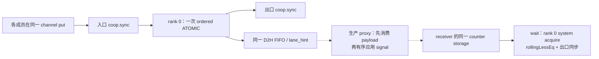

# HT adapter：类型、rank 与 signal 完成关系

状态：本分支接通实际 HT 调用形状，CPU 合同检查通过；本分支 CUDA 编译、原生 signal gate 和完整 Hybrid 尚未验证。父分支的 V2 速度数据固定在 `2abdfdce17ab5747e136701b4fdfd2d0bd5bff43`，不作为这个 adapter 改动的性能数据。

2026-10-05 单侧模型验收见 [Thor/RTX 5080 E2E](SINGLE_DEVICE_E2E.md)：全部 24 层真实 MoE 输入/输出连接实际 adapter 与 production FIFO，覆盖 B8–64/C32–128。本地源码已提供，两机尚未编译或运行；完整 vendored Hybrid 的 host bridge 缺口仍如下记录。

HT 的 dispatch 实际传入 `ncclGin_SignalAdd`、Warp、None、两个 release scope 和 flags；combine 用 Thread。原 adapter 的私有替代类型不能接收这些参数。可变参数 put 也无法推导真实调用中的空初始化参数。这里按 [NVIDIA NCCL 2.30.4 gin.h](https://github.com/NVIDIA/nccl/blob/v2.30.4-1/src/include/nccl_device/gin.h) 明确实现当前 HT 使用的子集。

| 入口 | 支持的合同 |
| --- | --- |
| put | 单一已注册 window；Thread；None remote/local action；Thread→Device release；Default/AggregateRequests |
| signal | 原生 SignalAdd；Thread/full Warp；值 0–16382；Default；Thread→Thread/Device release |
| read/wait | 64-bit indexed counter；system acquire；wait 使用 NCCL 的 rollingLessEq |
| flush | 父分支 Thread/Warp 实现；acquire completion |

不支持的 action/cooperation 在类型检查时拒绝；超出 offset、delta、size 或 order 范围会 trap。没有忽略 Coop 的 signal 重载。SignalAdd 的值 16383 在现有发送编码中是大值 sentinel，不能直接当作普通增量发送。

实线描述当前设备端接口，虚线的网络/host bridge 仍需接通与真实验收。signal 提交后返回不表示远端已经观察到；receiver wait 和 source flush 各自负责自己的完成条件。

## Rank 与索引

HT host 的 `ncclCommSplit` 使用 local rank 作 color、node ID 作 key，因此 rail communicator 中的 peer 是节点编号。UCCL proxy 使用全局 rank，转换为 `node * num_scaleup_ranks + scaleup_rank`；local world=1 时退化为原编号。

Ordered ATOMIC 的 `atomic_offset=1` 是 opcode 标记，`req_rptr` 是 counter 的原始字节偏移。因此 indexed signal 保留 `id * 8`，ID 0 有效。WRITE piggyback 才要求非零 counter slot。混用这两个规则会改变信号表并破坏 sender/receiver 对应。

现有 ordered immediate 的 offset mask 是 `0x1fff`。可编码的 8-byte slot 是 ID 0–1023；这项限制来自 wire 格式，不能因物理 atomic buffer 有 81960 bytes 就扩大 mask。`signal_slot` 在指针计算前检查该边界。

默认 HT `MAX_SUPPORTED_TOKENS_PER_RANK=8192`、chunk=64，即 128 chunks。源码按 dispatch、combine、streaming tail/head 和 32 barrier sessions 计算总信号数：

| 两节点配置 | dispatch | combine | tail | head | barrier | 总数 |
| --- | ---: | ---: | ---: | ---: | ---: | ---: |
| 每节点 1 GPU | 256 | 256 | 512 | 4 | 32 | 1060 |
| 每节点 8 GPU | 2048 | 2048 | 4096 | 32 | 32 | 8256 |

两种默认布局都超出当前 1024-slot indexed 范围。完整接入必须设计并验证这个布局与 wire 寻址的关系，不能截断 ID 或按模映射。

## 后端构造与 host bridge

构造宏修复四处接缝：dispatch 的 world 重声明、receiver 的未定义 channel、combine sender 的固定零 channel、combine receiver 直接构造 ncclGin。SIMPLE 宏接收实际 channel 并提供 world；NCCL 分支保留原两参数 constructor 的 sharing 语义。

kernel 参数与四个 network helper 的 resources 已贯通：host params 和 kernel params 内嵌同一个 bundle，实际 builders 复制后以 const reference 传入 helper；无需额外 device allocation。scan 和纯本地 helper 移除无用资源参数，NCCL backend 的布局不增加 UCCL 字段。LSA size1 显式构建和原生单 rank 数值链路见 [单卡 HT gate](SINGLE_DEVICE_E2E.md#原生-ht-单-rank-数值链路)，CPU 严格构建通过，CUDA 未执行。

跨节点公共 host API 仍缺 Context lifecycle bridge：Context 当前分配自己的 payload window；HT 注册的是 `gin_base_ptr`。必须接通同一 payload 存储、signal 存储的初始化/代际/context namespace 和释放时机。单 rank 数值测试提供有效私有队列/window 资源，并断言没有网络命令；它不掩盖跨节点 bridge 的缺口。

## 检查与下一 gate

| 检查 | 当前结果 |
| --- | --- |
| 实际 adapter 方法，CPU CUDA/FIFO substitutes | 36 signal cases ×10 generations，通过 |
| 普通、UINT64 回绕、INT64 边界 wait | 3 cases，通过 |
| 过宽 delta、sentinel、slot1024、过宽 put、bits32、relaxed read | 6 个子进程按预期自 abort；不是 CUDA trap 记录 |
| 实际 Hybrid constructor 宏，两个 backend | 严格 C++17 编译与 channel/sharing 检查通过；不是完整 Hybrid TU |
| 实际 HT params / builders / LSA switch | 6 个严格 C++17 构建与运行通过，10 字段完整传递；CUDA 未编译 |
| 原生 scan / dispatch / combine 高 B/C 单 rank | 两 backend、4 个高 B/C 和尾 chunk 已提供；未执行 |
| 原生 CUDA / production FIFO signal | 24 cases/卡已提供，未编译或执行 |
| CTA signal | 编译拒绝 gate 已提供，尚未执行 |
| EFA、完整 Hybrid、模型高请求并发 | 未完成 |

CPU 证据在 [host signal result](results/ht-contract/host-result.json) 和 [macro result](results/ht-contract/macro-result.json)。类型与 rolling comparison 取自 pinned NVIDIA source；执行使用 CPU substitutes，不推导 CUDA ABI、NIC completion 或模型吞吐。

新窗口内执行 `make adapter-tests adapter-compile-fail SM=120 NCCL_INCLUDE_DIR=...`，再在每卡运行 `build/sm120/adapter_signal --device 0`。该 gate 用实际 NCCL types、实际 UCCL 方法与 production FIFO：延迟非 leader；每代检查全部成员 WRITE 在唯一 ATOMIC 之前；检查 ID0/1023、rail rank1/2/8、真实 source 值和 counter；Thread/Warp 都 flush 后退出。consumer 只提供本地测试完成，仍不初始化网络。
