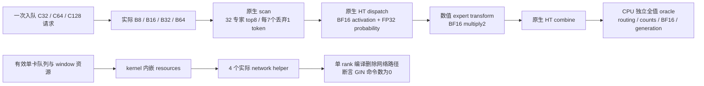

# Thor / RTX 5080 单机 E2E

2026-10-05 用户将本轮验收改为 Thor、RTX 5080 **各自单机单侧测试**，重点是高请求并发和大 batch。原有 5090 测量保持原样。

状态：补充 RTX5090 原生资格已完成；**Thor / RTX5080 两机 CUDA、完整模型正确性、速度测量均未执行**。两机仍由前驱任务保留 whole-job 窗口，暂时空锁和空闲 GPU 不构成交接。

已完成的准备证据：[42 个分片形状](results/single-e2e-preparation/host-preparation.json)、[实际异步调度器的 4 个 CPU 组合](results/single-e2e-preparation/host-request-wave.json)、[固定权重的本机下载和 LFS 校验](results/single-e2e-preparation/model-inputs.json)。权重在开发过程中并行下载，2,671,359,655 bytes；这些准备结果不代表 GPU/model 测试通过。

三个 arm 已按 `3e9ea407` [重新冻结输入](results/single-e2e-preparation/current-inputs-3e9ea40.json)，共同包含 signal 常量和本地 include 修复，production GIN 字节与原三个固定版本相同。旧 `ad7dc31` 包保留供核对。

## 模型与数据流

使用公开的 [Granite 3.1 1B-A400M Base](https://huggingface.co/ibm-granite/granite-3.1-1b-a400m-base/tree/408b6e90baab8cf24f4aa9f8e19703ffa0a53b29)，固定 revision `408b6e90baab8cf24f4aa9f8e19703ffa0a53b29`。其[配置](https://huggingface.co/ibm-granite/granite-3.1-1b-a400m-base/blob/408b6e90baab8cf24f4aa9f8e19703ffa0a53b29/config.json)是 24 层、32 专家、top-8、hidden1024、BF16。使用任务私有 Transformers 4.57.1 环境与实际权重。

```mermaid
flowchart LR
  R[C32 / C64 / C128 异步请求] --> B[实测 B8 / B16 / B32 / B64]
  B --> A[完整模型 attention / norm]
  A --> D[每层 MoE 输入 GIN put]
  D --> Q[生产 MSCCLPP FIFO]
  Q --> H[本地测试 receiver<br/>D2H 全字节比对 → H2D]
  H --> S[ordered signal → counter]
  D --> F[flush → 立即覆盖 source → wait]
  S --> F
  F --> E[原模型 router / 32 experts / 加权聚合]
  E --> C[每层 MoE 输出再次经过 GIN]
  C --> N[其余层 / logits / 完整 greedy decode]
  N --> O[全部 logits hash 与 token IDs<br/>对照同 batch 原模型]
```



`model_transport.cu` 以 C ABI 接收真实 tensor 指针，调用实际 typed HT adapter 的 put、SignalAdd、Warp flush、waitSignal。每 batch 用 `min(B,64)` 个 warp，各 warp 的 32 个成员分担不重叠、允许不均匀的 activation 分片；同组 put/signal 固定 channel。测试 receiver 在每个 WRITE 的实际 D2H 源读取、完整字节校验和 H2D 接收完成后才 pop，在该组全部 32 个 WRITE 完成后释放唯一 signal。flush 返回后立即覆盖私有 source；模型继续使用接收 tensor。

全部 24 层的 MoE 输入和已聚合输出都经过这条链路。原 Transformers router、expert 分组、SwiGLU 和加权聚合保持原实现；此测试没有调用 vendored `ncclEpDispatch/ncclEpCombine` kernels。接收端是测试完成实现，两个逻辑 rail rank 共用单块设备内存。它验证单机完整模型与 GIN/FIFO/adapter 的闭环，不提供 NIC、EFA receiver 或跨节点带宽证据。

每个进程先运行 7 个原生 tensor case，覆盖组数增减与不均匀分片。模型执行线程串行使用其私有资源，上次 kernel 和 consumer 全部退出后才更新 counter 代际。model stream、GIN kernel 和独立 nonblocking copy stream 的依赖显式完成；stream、event、pinned buffers 在 producer 启动前创建。

## 原生 HT 单 rank 数值链路

`ht_single_rank.cu` 另行调用 vendored `call_metadata_preprocessing`、`call_dispatch`、`call_combine`，执行原始 scan / dispatch / combine CUDA kernels。新增 LSA size=1 的显式构建实例；NCCL 与 UCCL 两个 backend 都构建。kernel 内嵌 resources，由实际 host builder 复制、以 const reference 传入四个 network helper；scan 和纯本地 helper 不接收无用参数。



每请求 128 tokens，batch 的 1024/2048/4096/8192 tokens 使用相同 hidden1024、32 experts、top8。另测 B8C32 最后请求减少4 tokens，形成60-token尾 chunk。独立 CPU oracle 比对所有 sparse/dense map、expert counts、rank mask、local routing、dispatch BF16/probability、combine BF16（含被丢弃 token 的零值），并检查单调 flag、grid counter 复位和所有网络队列为空。C 个请求先实际进入队列，单执行线程按 B 完成，报告实际 pending/batch/completion 数。

此数值链路的 expert transform 用于验证搬运与 reduction；完整 Granite 推理仍由上一节验证。它执行 HT kernels，尚不提供 `ncclEpCreateGroup` 公共 host API、跨节点 Context bridge 或 NIC 证据。单 rank 路径没有 GIN 流量，其 CUDA event 时间只是数值测试诊断，不能作为 flush 加速比。[实际参数 builder 的 6 个 host 构建](results/single-e2e-preparation/ht-host-result.json)、[两个实际 constructor 宏](results/single-e2e-preparation/ht-host-macro-result.json)通过；补充 RTX5090 上的两个实际 CUDA backend 共70轮也已通过，原始结果见下文。Thor / RTX5080 仍须分别执行。

```sh
make ht-tests SM=120 NCCL_INCLUDE_DIR=/path/to/nccl-include
build/sm120/ht_single_rank-uccl --batch 64 --concurrency 128 --rounds 7
```

使用官方 NCCL 2.30.4 头文件时，上述单卡构建还需传入 `EXTRA_DEVFLAGS=-DNCCL_GIN_GDAKI_ENABLE=0`。这些 gate 不使用 GDAKI/DOCA；缺少开发头文件的现有环境无需安装该后端。三个比较 arm 使用同一选项。

补充 RTX5090 r5 在源码 `3e9ea407` 上完成[实际原生资格](results/native-qualification-westd/README.md)：70轮 HT（两个 backend、四个高 B/C 与尾 chunk）、24 signal cases、7 不均匀 tensor cases 和队列 gate 均通过，14个测试进程/控制器/SSH/make 全部自然退出0，证据已收集并归还 GPU0 / IO。四次构建失败仍完整保留。r5 没有完整 Granite 或正式速度测量；Thor / RTX5080 的未执行状态保持不变。

## 有限矩阵与证据

| 单机 case | 最大 batch | 同时待处理请求 | Prefill / Decode | 模型路径 |
| --- | ---: | ---: | --- | --- |
| B8C32 | 8 | 32 | 64 / 4 tokens | 全部 24 层 |
| B16C64 | 16 | 64 | 64 / 4 tokens | 全部 24 层 |
| B32C128 | 32 | 128 | 64 / 4 tokens | 全部 24 层 |
| B64C128 | 64 | 128 | 64 / 4 tokens | 全部 24 层 |

`C` 是同时提交且实际记录在请求队列中的 coroutine 数；一个模型执行线程将请求组成真实 batch。每轮记录 `peak_pending_requests` 和全部 `actual_batches`。它是进程内请求服务测试，请求并发与 warp/线程 producer 数分别报告。

同一 fixture、编译参数、model revision、prompt、dtype、信号合同，对比 Scalar HT、V1 HT、V2 HT。Scalar HT 保留原 adapter 每成员调用 scalar flush 的行为；三个 arm **共同使用当前 typed put/signal adapter 前置修复**。V1/V2 编译各自固定的 production `uccl_gin.cuh`，不重写其 flush。

每 case 采用 ABC/CBA 六个独立模型进程；每进程 7 轮、前 2 轮标记 warmup，每 arm 合并 10 个 warm 样本。原始单轮结果、全部 logits digest、token IDs、实际命令计数、源/库 hash、机器和进程终态都保存。Nsight 只用于独立诊断 run，不混入速度表。

每轮必须与同 batch 原模型的所有生成 token、所有 decode-step logits digest 完全一致。C++ 每个 WRITE 完整比对源字节，严格检查每个 producer/channel、每组 32 WRITE→一个 signal，以及所有 QUIET 数。每轮完整模型计数为：

* calls = `(C/B) × decode_steps × 24 × 2`；本矩阵 C 能整除 B。
* signals = `C × decode_steps × 24 × 2`，WRITE = signals × 32。
* Scalar QUIET = signals × Q × 32；V1/V2 QUIET = signals × Q。
* bytes = `C × (prefill_tokens + decode_steps − 1) × hidden × 2 × 24 × 2`。

## 文档验收映射

| 原文档项 | 本轮两机单侧 gate | 完成证据 |
| --- | --- | --- |
| 原执行文档 §6.4 A–F：计数、入口、全员完成、source reuse、多组、实际 adapter | 原 `coop_flush` + 新 model native gate + `adapter_signal` + 两个 compile-fail | 每机原生日志与终态；未运行 |
| V2 review：大 payload、lane/warp affinity、Q1/3/32/33/64、分段诊断 | 原 fixture 在每机重跑高 G64 / BS2048，单 GPU 即可 | 三 arm 原始分轮结果；未运行 |
| handoff / V2 design 中的实际模型、请求并发缺口 | 上述 4 case，全部 24 层 GIN 链路与模型输出对照 | 实际 B/C、全部 logits/tokens、速度 MD；未运行 |
| HT adapter 类型、rail rank、signal index、counter lifecycle | 原 24-case `adapter_signal`，另加 native tensor 不均匀 partition/代际 gate | 每机实际 CUDA 结果；未运行 |
| NCCL_EP_PLAN 的原生 HT dispatch/combine 数值 gate | 上述原生 scan→dispatch→数值 transform→combine，两 backend、高 B/C 和尾 chunk | 每机 CUDA 原始日志与 oracle；未运行 |
| NCCL_EP_PLAN 的 EFA、跨节点 host bridge | 保留原范围与缺口 | 单卡测试不提供 NIC 或公共 host API 集成证据 |

## 执行与清理

先核对已有终态、源码和资源 owner，复用完成证据；交接前仅做本地准备。一机有限 case 执行时，另一机在其获准窗口内准备或下载；缓存使用本任务私有目录。每机完成这个模型的全部 arm/case，保存并核实证据后，立即清理**本任务拥有的权重**。已有其他任务的 model/cache 只读且不清理。禁止访问 lcpu NFS。

整轮控制器按 native HT → 三 arm 构建 → signal/tensor/flush 正确性 → 高 BS 通信矩阵 → 独立诊断 → 完整模型 → 速度汇总执行。所有子阶段继承父进程的同一组 lock fd；父进程在阶段切换时继续持锁。任务私有 HF/Torch/Triton/Inductor 缓存与禁止写入共享 bytecode 的环境变量随子进程传入。交接后取得的既有 runtime 文件 manifest 在整轮开始和结束分别校验。

本机 [实际 fd/flock 检查](results/single-e2e-preparation/host-resource-inheritance.json)执行了[三个控制器的原始锁代码](results/single-e2e-preparation/controller-lock-sections.json)：两次子阶段退出后，独立竞争进程仍被阻塞；父进程释放后两锁可取，三个独立启动模式也通过。首次 checker 的括号错误[保留](results/single-e2e-preparation/host-resource-checker-initial-failure.json)，修正后通过。这些是 Darwin host 证据；目标机仍须实际执行。

[整轮输入 manifest](results/single-e2e-preparation/whole-machine-inputs.json)固定21个控制器/源码包/头文件输入，不包含权重、runtime 快照或机器 grant。权重仍使用已下载的固定版本，获准后传到任务私有目录。控制器退出后还需从外部确认自然终态、收集证据、清理本任务权重并交回窗口；`results_ready` 不表示整轮任务已完成。

速度 MD 将列出同机同 case 的 median、p95、requests/s、tokens/s、Scalar/V2、V1/V2，并保留低于 1× 的行。当前没有 Thor/5080 性能数字。
